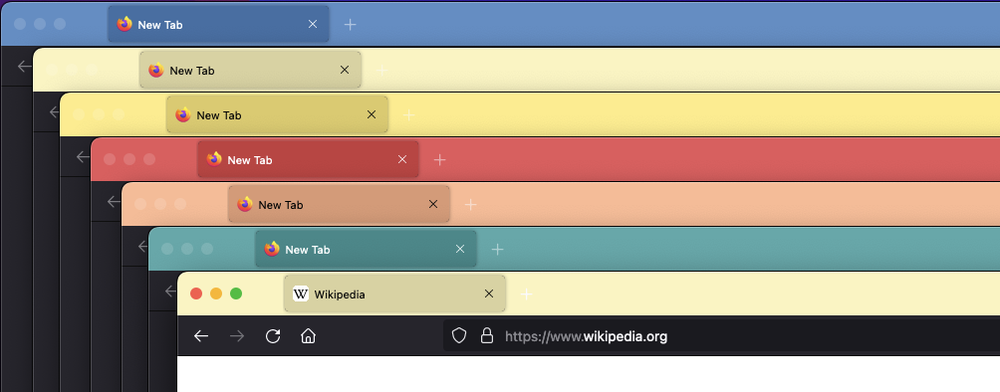
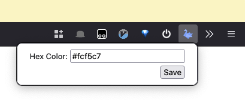

# Firefox Peacock

A small browser extension that dynamically sets the color for the Firefox title bar frame. Inspired by [VS Code Peacock](https://marketplace.visualstudio.com/items?itemName=johnpapa.vscode-peacock).

New windows will have a random color from a list of presets. This extension also allows setting each window's color manually with a hex value.

_One of several colors will be automatically picked on opening a new window._

_The color for each window is individually customizable in that window's popup settings._

## Planned Features

- Improved popup UI.
- Add an extension settings menu.
- Expose setting for list of colors that new windows pull from.
- Add a button to randomly select a color.
